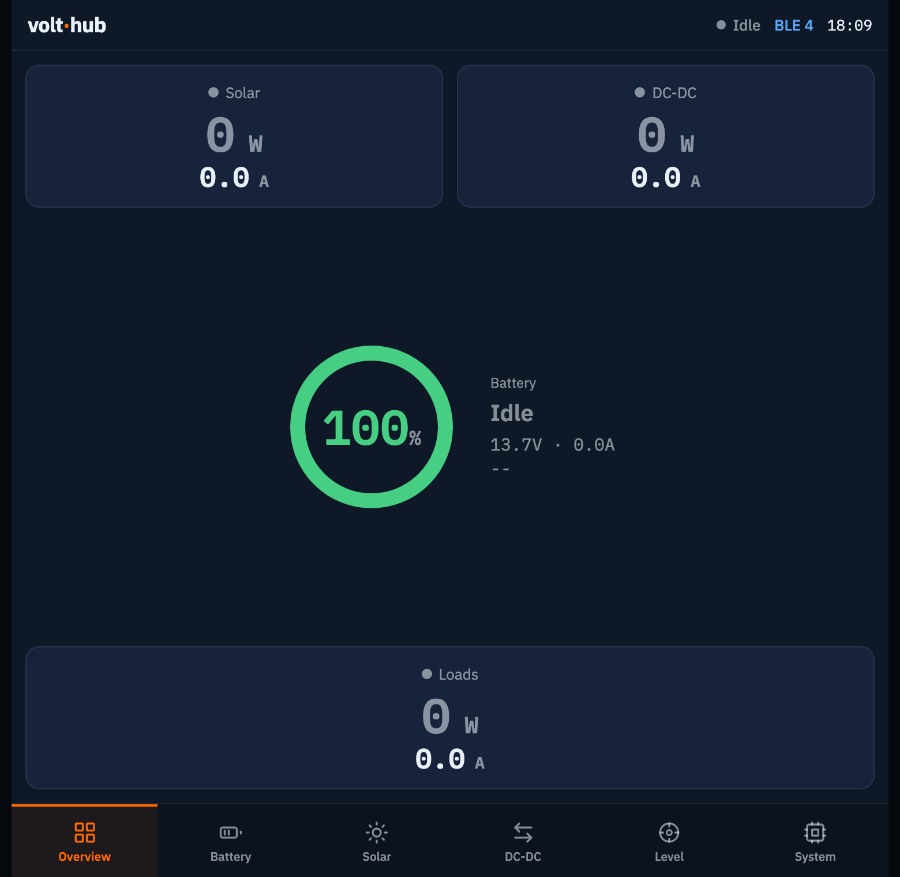
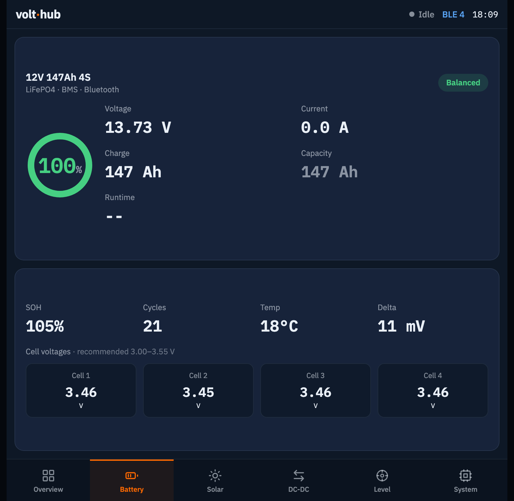
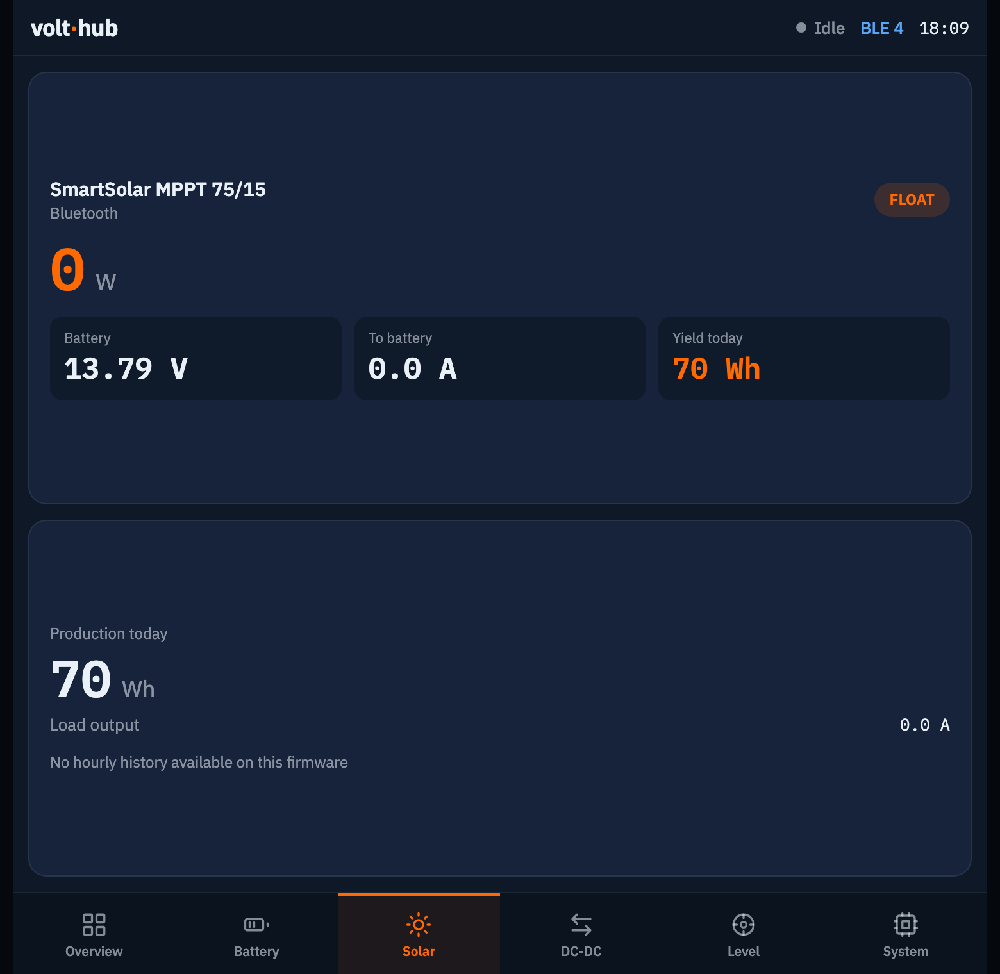
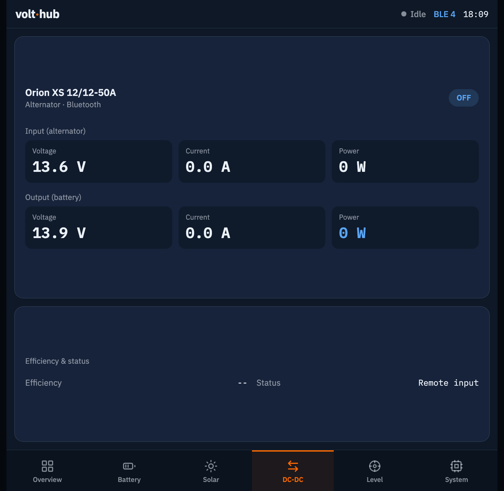
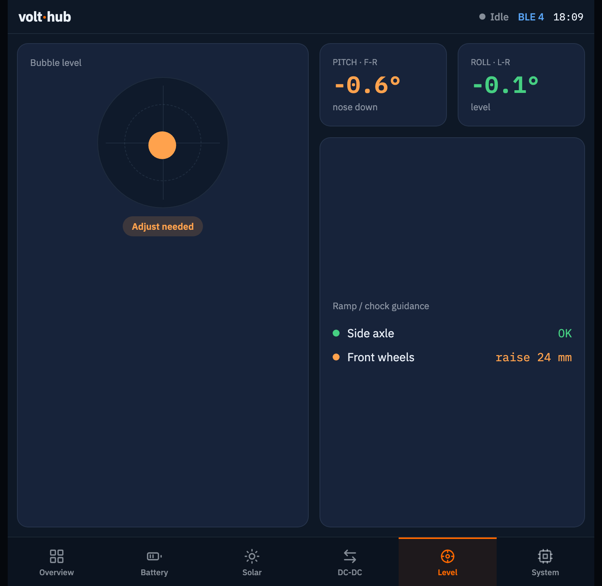
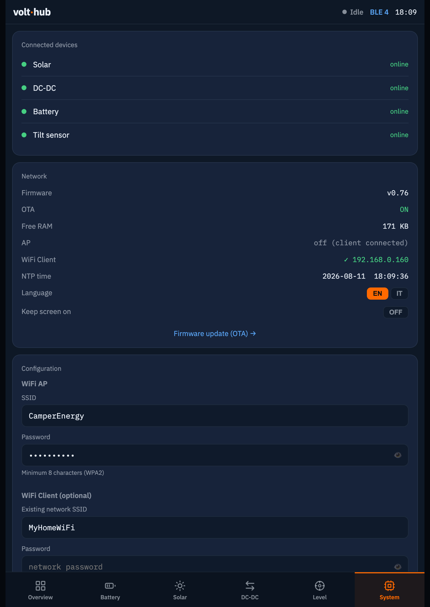
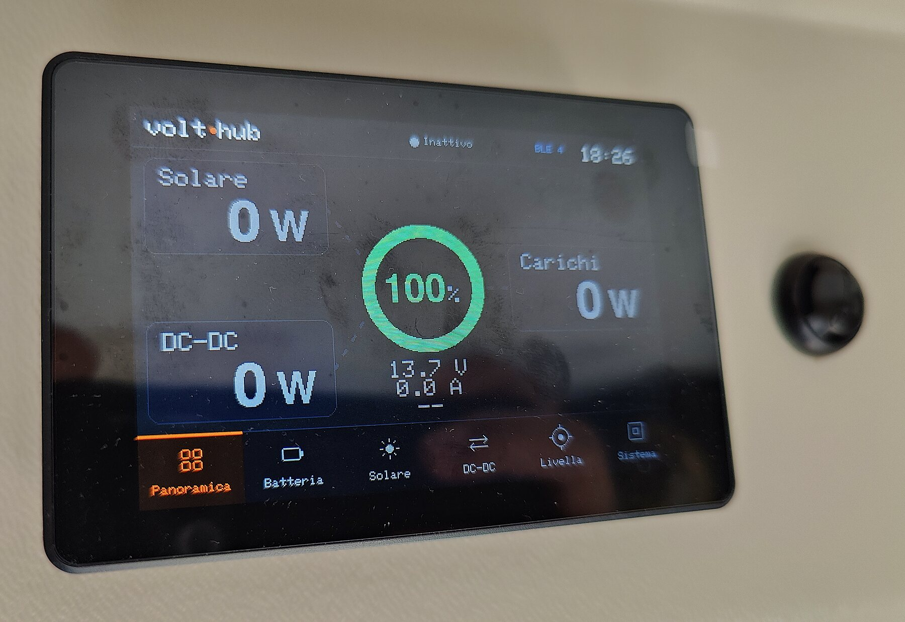
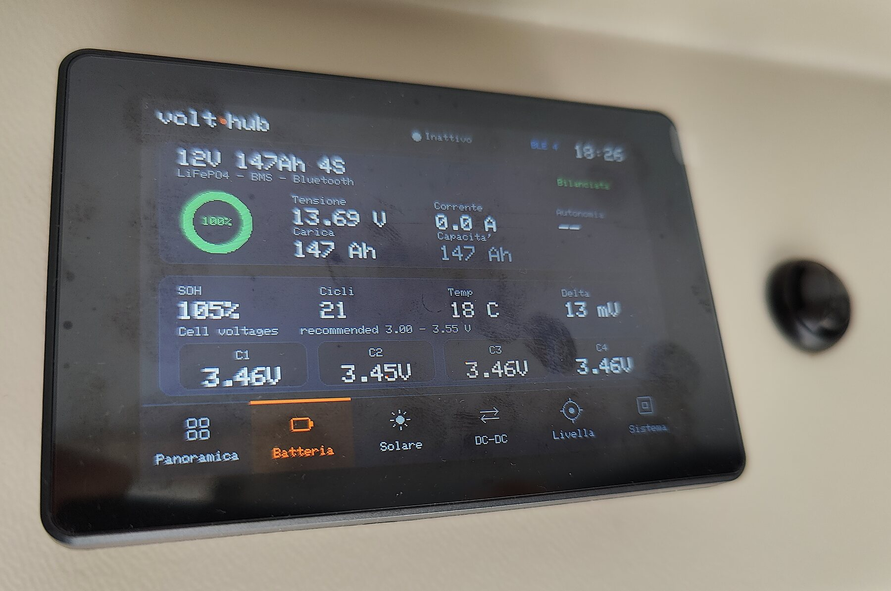
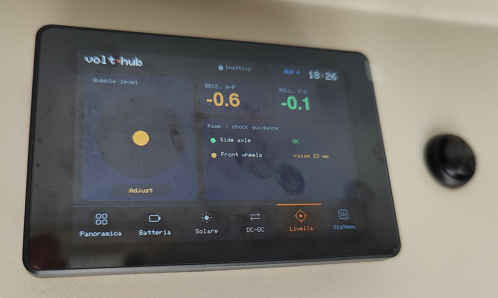
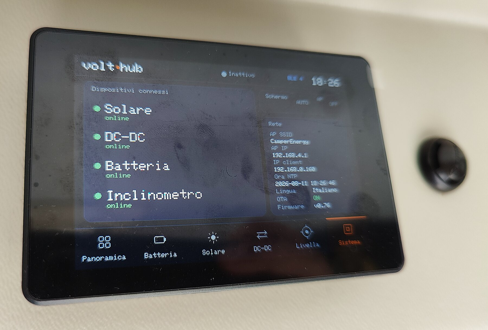

# volthub — Camper Energy and Leveling Monitor

A self-contained energy **and levelling** dashboard for a camper/RV, running on an ESP32
touchscreen display. It reads a **LiTime BMS**, a **Victron SmartSolar** MPPT and a
**Victron Orion‑XS** DC‑DC charger over Bluetooth LE for the electrical side, and a
**Witmotion** tilt sensor for pitch and roll, so you can also see how level the vehicle is
when you park. Everything shows on the built‑in screen **and** on a phone/browser over
Wi‑Fi — with **no GX device, Raspberry Pi or cloud** required.

> Firmware for two touchscreen boards: the **Guition JC3248W535C** (ESP32‑S3, primary)
> and the **ESP32‑2432S035R "CYD"** (ESP32). Both share the same UI and web dashboard.

---

## Features

- **Live overview** — solar, DC‑DC and loads power, battery ring (SOC), voltage/current,
  animated energy‑flow lines, colour‑coded by state (producing / discharging).
  *Loads* is the battery **discharge** reported by the BMS, i.e. what the loads actually draw
  from the battery (net of what solar/DC‑DC already cover); it reads 0 while charging or idle.
- **Runtime estimate** — time to empty while discharging, time to full while charging, derived
  from the BMS coulomb counter (`remainingAh`) and a smoothed current, so it does not jump on
  every compressor start. Shown on the overview and the Battery screen.
- **Levelling** — a spirit level fed by the tilt sensor: pitch and roll with green/amber/red
  zones, so you can tell at a glance how much the vehicle needs to be raised, and on which side,
  before putting the ramps under a wheel.
- **Detail screens** — Battery (per‑cell voltages, SOH, cycles, temperature, balance
  delta with alarm thresholds), Solar and DC‑DC.
- **Real charge state** — the actual Victron mode (Bulk / Absorption / Float / Storage /
  BatterySafe …) for both the MPPT and the DC‑DC, decoded from the advertisement and named
  after the official VE.Direct state table — not guessed from the current.
- **Web dashboard** — same data on any phone/browser over Wi‑Fi; live polling of a JSON API.
  Includes a **"Keep screen on"** toggle so the phone does not lock while you watch the dashboard
  (works over plain HTTP, where the Screen Wake Lock API is unavailable).
- **Exact device models** — Victron model name resolved from the BLE Product ID
  (official VE.Direct product‑id table).
- **Dual language** — English / Italian, switchable from the web System tab.
- **OTA updates** — disabled by default; enable it and set the credentials from the web
  System page (nothing hardcoded, no credentials in the repo).
- **NTP clock**, configurable Wi‑Fi (AP + optional client), persisted settings (NVS). The AP can
  optionally [switch itself off while the client is connected](#turning-the-ap-off-while-the-client-is-connected),
  so your phone stops auto‑joining it — with an on‑screen button and a boot grace window so you
  can never be locked out.
- **CSV data log** — optional, off by default: one row every 2 minutes to internal flash
  (`volthub_YYYYMMDD.csv`), with battery, solar and DC-DC readings. Enable it and download the
  files from the web System tab. See [Data log](#data-log-csv).
- **Built to run for days** — no‑leak BLE scanning, non‑overlapping web polling and a free‑RAM
  readout in the System tab, so the dashboard stays reachable on long trips.

## Screenshots

### Web dashboard

Real screenshots from a running device (a 12 V 147 Ah LiFePO4 bank, SmartSolar MPPT in float and
an Orion XS, at rest in the evening — hence the zeros on the power figures).

<p align="center"></p>

| Battery | Solar |
|---|---|
|  |  |
| Per-cell voltages, SOH, cycles, balance delta, runtime estimate | Charge state, battery-side V/A, yield today |

| DC-DC | Level |
|---|---|
|  |  |
| Alternator and battery side each with V / A / W, efficiency and off reason | Spirit level fed by the IMU |

<p align="center"></p>
<p align="center"><em>System: connected devices, network, firmware, language, and the configuration form
(values shown are placeholders)</em></p>

### Device screen

The same firmware on the built-in display — here a Guition JC3248W535C installed in the camper.
The device is running the **Italian** UI, the web screenshots above the English one: the language
is switchable at runtime from the web System tab.

| Overview | Battery |
|---|---|
|  |  |

| Level | System |
|---|---|
|  |  |

## Hardware

The firmware targets two low‑cost, all‑in‑one ESP32 touchscreen boards. No custom wiring
is required — the displays and touch controllers are integrated on the board.

| | **Guition JC3248W535C** (primary) | **ESP32‑2432S035R "CYD"** |
|---|---|---|
| MCU | ESP32‑S3, 240 MHz, 8 MB PSRAM, 16 MB flash | ESP32, 240 MHz |
| Display | 3.5" IPS, AXS15231B, **QSPI**, 320×480 → landscape 480×320 | 3.5" ILI9488, SPI, 480×320 |
| Touch | AXS15231B integrated, I²C | XPT2046 resistive, SPI |
| PlatformIO env | `guition` | `cyd` |

### Monitored BLE devices

| Device | Protocol | Notes |
|---|---|---|
| LiTime BMS | active GATT (notify `ffe2` / write `ffe1`) | 2 s poll, 104‑byte frame |
| Victron SmartSolar MPPT | passive BLE advertisement | AES‑128‑CTR decrypted (key from VictronConnect) |
| Victron Orion‑XS DC‑DC | passive BLE advertisement | AES‑128‑CTR decrypted |
| Witmotion WT9011DCL IMU | active GATT (service `FFE5`) | pitch/roll/yaw for the level screen |

## Download

Prebuilt firmware for both boards is attached to every
[release](https://github.com/nantostars/volthub/releases), built by CI from the tagged commit:

| File | Use |
|---|---|
| `volthub-<ver>-<board>-ota.bin` | upload from the web **System → Firmware update (OTA)** |
| `volthub-<ver>-<board>-factory.bin` | first flash of a blank board over USB |

```bash
# blank board, single command (offset 0 — the image already contains bootloader and partitions)
esptool.py --chip esp32s3 write_flash 0x0 volthub-<ver>-guition-factory.bin
esptool.py --chip esp32   write_flash 0x0 volthub-<ver>-cyd-factory.bin
```

Or build it yourself:

## Build & flash

The project uses [PlatformIO](https://platformio.org/).

```bash
# Build
pio run -e guition        # ESP32-S3 Guition board
pio run -e cyd            # ESP32 CYD board

# Flash (replace the port with yours)
pio run -e guition -t upload --upload-port /dev/cu.usbmodemXXXX   # Guition (USB-JTAG)
pio run -e cyd     -t upload --upload-port /dev/cu.usbserial-XXXX # CYD
```

- **Guition tip:** if the board is in a crash loop, hold the **BOOT** button during flashing.
- **OTA:** off by default. In the web dashboard go to **System → Configuration → Firmware
  update (OTA)**, tick *Enable OTA*, set a username and password, and save. Then open
  `http://<device-ip>/update` (HTTP Basic Auth with those credentials) and upload
  `.pio/build/<env>/firmware.bin`. OTA works only while enabled with both credentials set.

## Configuration

- **Compile‑time defaults** live in `src/Config.h` (Wi‑Fi AP SSID/password, NTP,
  default device MACs). No secrets/credentials are kept in the repo.
- **OTA** is enabled and configured at runtime from the web System page (stored in NVS),
  disabled by default.
- **Victron keys** are the per‑device AES keys from the VictronConnect app
  (Product info → *Show encryption data*). Set them at runtime from the web **System → Configuration** form; they are stored in NVS.
- **Runtime settings** (Wi‑Fi client, device MACs, language, screen timeout) are set from
  the web dashboard and persisted in NVS.
- **Default Wi‑Fi:** Access Point `CamperEnergy` / `camper1234`; the dashboard is at
  `http://192.168.4.1`. Those defaults are in the public source, so **change the AP password**
  from **System → Configuration → WiFi AP** on first use — anyone in range knows the factory one.

### Turning the AP off while the client is connected

Optional, **off by default** (web **System → Configuration → WiFi Client**). When enabled, the
device drops its own access point while it is connected to an existing Wi‑Fi network, so your
phone stops auto‑joining `CamperEnergy` and losing its internet connection.

The device **cannot** know whether your phone can actually reach it over that network — client
isolation and captive portals, both common on campsite Wi‑Fi, are invisible from the ESP32 side.
So the safety net is not network logic but two physical ways back in:

1. **The `AP` button on the device System screen.** It shows the current mode and a tap always
   changes it — it can only switch the AP **on** or hand control back to the automation, never
   turn it off, so a stray tap cannot lock you out.

   | Button | Meaning | A tap… |
   |---|---|---|
   | `OFF` (grey) | AP is down | turns it on → `ON` |
   | `ON` (green) | AP is up and pinned on | hands back to the automation → `AUTO` |
   | `AUTO` (green) | AP is up, the automation may drop it | pins it on → `ON` |

   With the option disabled the button reads a permanent `ON`: there is no automation to hand
   control to, and the AP never goes down.

2. **A power cycle.** The AP is unconditionally on for **10 minutes after every boot**, so
   switching the device off and on always gets you back in, even if the touchscreen is
   unresponsive.

Automatic behaviour: the AP is dropped only after the client link has been up for **2 minutes**
continuously, and comes back **60 seconds** after the link is lost (not instantly, so it does not
flap on a shaky network), restarting the 10‑minute grace window. It never applies if no client
network is configured.

**Known limitation:** if you are away from the vehicle and the client network isolates its
clients, the AP stays off until you are physically back at the device. That trade‑off is why the
option ships disabled.

### Data log (CSV)

Optional, **off by default**, enabled from the web **System → Data log** card. One row every
2 minutes is appended to `volthub_YYYYMMDD.csv` on the device's internal flash; the same card
lists the files with a download link and a delete button.

Columns: `datetime, batt_soc, batt_ah, batt_v, batt_a, batt_temp, batt_st, sol_batt_v,
sol_batt_a, sol_st, dc_alt_v, dc_alt_a, dc_batt_v, dc_batt_a, dc_st`. `batt_ah` is the BMS
coulomb counter — use it for energy maths rather than integrating `batt_a`, which the BMS
quantises in ~0.5 A steps. Statuses are numeric codes — battery
`1` charging / `0` idle / `-1` discharging; solar and DC‑DC use the official VE.Direct state codes
(3 bulk, 4 absorption, 5 float, …). An empty field means the reading was unavailable, so
spreadsheets treat it as missing rather than a real zero. PV voltage and current are not logged
because the Victron advertisement does not carry them.

Storage is the 128 KB internal partition (LittleFS): about **55 KB a day**, so roughly **1.8 days**
fit — in practice today's file plus part of yesterday's. One file is written per day and the oldest
is pruned whenever free space drops below 15 KB; that free-space rule *is* the retention policy.
(A 3-file cap also exists, but only as a guard in case a wrong clock spawns several small files —
space runs out long before the count matters.) Rows are buffered and written once every 10 minutes, so the log costs one small
flash write per 10 min — no perceptible impact, and flash wear is negligible.

**Clock:** the board has no battery-backed RTC, so without a date there is no filename and no
usable timestamp — logging waits in *"waiting for clock"*. Opening the dashboard fixes this even
with no internet: the page hands the device your phone's clock (`POST /api/time`), which is
ignored once NTP has synced.

## Web dashboard & API

The dashboard is embedded in the firmware (`src/Dashboard.h`) and served over Wi‑Fi. It
polls `GET /api/data` (JSON) every 2 s. Settings are read/written via `/api/settings`.

`GET /api/data` returns one object per source — handy if you want to feed the data somewhere
else (logger, Home Assistant, …). Every block has an `online` flag; when it is `false` the
other fields are omitted rather than zeroed.

| Block | Fields |
|---|---|
| `battery` | `online`, `voltage`, `current` (+ = charging), `power`, `soc`, `soh`, `cycles`, `remainingAh`, `fullAh`, `cellTemp`, `mosfetTemp`, `cells[]`, `model`, `etaMin`, `etaFull` |
| `solar` | `online`, `state`, `stateCode`, `error`, `errCode`, `battVoltage`, `chargeCurrent`, `solarPower`, `yieldToday`, `loadCurrent`, `pid`, `model` |
| `orion` | `online`, `state`, `stateCode`, `error`, `errCode`, `offReason`, `offMask`, `inVoltage`, `inCurrent`, `outVoltage`, `outCurrent`, `pid`, `model` |
| `imu` | `online`, `pitch`, `roll`, `yaw`, `temp` |
| `sys` | `fw`, `lang`, `ota`, `heap`, `apIp`, `staIp`, `date`, `time`, `apOn`, `apAuto` |

`etaMin` is the runtime estimate in minutes (`0` = not meaningful: at rest, offline or already
full); `etaFull` tells whether it counts down to full (charging) or to empty (discharging).

## Versioning & changelog

Change‑based versioning: `FW_VERSION` in `src/Version.h` is bumped on every commit and a
matching entry is added to [`CHANGELOG.md`](CHANGELOG.md). The current version is shown on
the device **System** screen and in the web **System** tab.

## Open‑source components

This project builds on the following open‑source software:

| Component | Purpose | License |
|---|---|---|
| [NimBLE‑Arduino](https://github.com/h2zero/NimBLE-Arduino) | BLE stack | Apache‑2.0 |
| [ArduinoJson](https://github.com/bblanchon/ArduinoJson) | JSON API | MIT |
| [TFT_eSPI](https://github.com/Bodmer/TFT_eSPI) | CYD display driver | MIT |
| [Arduino_GFX](https://github.com/moononournation/Arduino_GFX) | Guition (AXS15231B QSPI) display driver | BSD‑3‑Clause |
| [Adafruit GFX fonts](https://github.com/adafruit/Adafruit-GFX-Library) (FreeSansBold) | large UI numerals | BSD |
| [Arduino‑ESP32](https://github.com/espressif/arduino-esp32) core | framework | LGPL‑2.1 |
| Mbed TLS (via ESP‑IDF) | AES‑128‑CTR for Victron decryption | Apache‑2.0 |

Victron product‑id names are derived from Victron Energy's public **VE.Direct Protocol**
documentation. Victron, SmartSolar, Orion‑XS, LiTime and Witmotion are trademarks of their
respective owners; this project is not affiliated with or endorsed by them.

## License

Released under the [MIT License](LICENSE) © 2026 nantostars.

Third‑party components remain under their own licenses (see the table above).
